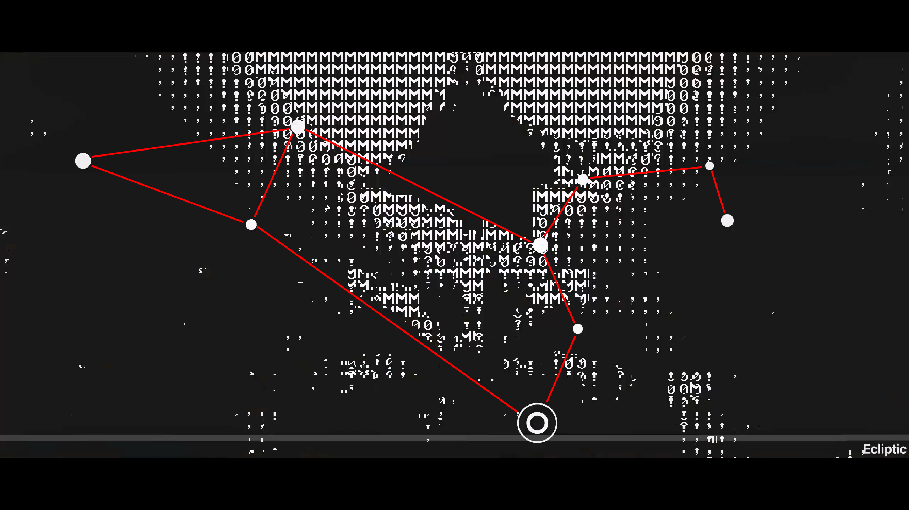

# 目录

- [目录](#目录)
- [谜题的入口](#谜题的入口)
- [线索](#线索)
  - [线索一](#线索一)
  - [线索二](#线索二)
  - [线索三](#线索三)
  - [线索四](#线索四)
  - [线索五](#线索五)
  - [线索六](#线索六)
  - [线索七](#线索七)
- [用户名与密码](#用户名与密码)
- [包裹](#包裹)
  - [彩蛋](#彩蛋)
  - [磁带](#磁带)
  - [纸片](#纸片)
- [Lynchpin 网站](#lynchpin-网站)
- [Code49](#code49)
- [bymyside 网站](#bymyside-网站)
- [网页测试](#网页测试)
- [分支剧情](#分支剧情)
    - [结果为白的剧情：](#结果为白的剧情)
    - [结果为蓝的剧情：](#结果为蓝的剧情)
- [推荐阅读](#推荐阅读)


# 谜题的入口
2024年4月27日，明日方舟发布了[游戏概念宣传PV-4](https://www.bilibili.com/video/BV1VC411H78i/)，由于有在PV中藏解谜的传统，大家立刻开始在视频中寻找蛛丝马迹，一些明显的线索很快就被发现，但谜题的入口仍然未知。

直到第二天，有人在[森空岛版](https://www.skland.com/article?id=1791684)的3:08附近，发现了一些非常暗淡的点状图案。

>没有特殊说明，本视频中使用的PV4画面以最清晰的[微博2K版](https://weibo.com/6279793937/ObHllF4sU)为准。但由于该版疑似有压制问题导致这里的ITA2码看不清，因此这里使用[森空岛版](https://www.skland.com/article?id=1791684)。


截图并提亮后，可以发现这是ITA2码，也叫国际电报码，用于在电传打字机中的打孔纸带上存储信息。两边的大点也就代表着纸带上的孔，而中间的小点则是用于定位和判断纸带的方向。


ITA2 码有一共五位，中间用一个 · 隔开。通常来说最低为 1 在右侧，最高位 5 在左侧。也就是说如果竖着读，三个点放在左侧，两个点在右侧：

>一些特殊情况下也可能会反过来

```
543 21
000·00
```

而横着读的话就是两个点在上面，三个点在下面。

将点视为 1，空白视为 0，将图像转换为数字：
```
001·01
100·00
000·11
011·00
010·01
110·01
101·01
101·00
000·01
010·10
001·01
001·10
010·01
000·01
```

随后按照方向对照查找表即可解码出文字：`standbyherside`

>FS 与 LS 用于在字母与数字符号间切换。在当前我们无法得知使用哪种模式时，可以分别进行尝试。

ITA2 码表：

| LSB on Right | LSB on Left | ITA2 字母 | ITA2 数字符号 |
| --- | --- | --- | --- |
| 000·00 | 00·000 | Null | Null |
| 010·00 | 00·010 | Carriage return	| Carriage return	|
| 000·10 | 01·000 | Line feed | Line feed |
| 001·00 | 00·100 | 空格 | 空格 |
| 101·11 | 11·101 | Q | 1 |
| 100·11 | 11·001 | W | 2 |
| 000·01 | 10·000 | E | 3 |
| 010·10 | 01·010 | R | 4 |
| 100·00 | 00·001 | T | 5 |
| 101·01 | 10·101 | Y | 6 |
| 001·11 | 11·100 | U | 7 |
| 001·10 | 01·100 | I | 8 |
| 110·00 | 00·011 | O | 9 |
| 101·10 | 01·101 | P | 0 |
| 000·11 | 11·000 | A | – |
| 001·01 | 10·100 | S | ' |
| 010·01 | 10·010 | D | WRU? *(Who are you?)*|
| 011·01 | 10·110 | F | ! |
| 110·10 | 01·011 | G | & |
| 101·00 | 00·101 | H | £ |
| 010·11 | 11·010 | J | Bell |
| 011·11 | 11·110 | K | ( |
| 100·10 | 01·001 | L | ) |
| 100·01 | 10·001 | Z | + |
| 111·01 | 10·111 | X | / |
| 011·10 | 01·110 | C | : |
| 111·10 | 01·111 | V | = |
| 110·01 | 10·011 | B | ? |
| 011·00 | 00·110 | N | , |
| 111·00 | 00·111 | M | . |
| 110·11 | 11·011 | FS（切换到数字符号） | *保留* |
| 111·11 | 11·111 | *保留* | LS（切换到字母/删除） |


结合点状信息前面的 http:// 提示以及[之前解谜的经验](https://prts.wiki/w/ORACLE_DATABASE/index/pv3#线索01)，将这段文字加到明日方舟官网链接的后面，即可进入[解谜网站](https://ak.hypergryph.com/standbyherside/)。

而进入网站的第二种方式在几周后被解出，将视频2:30左右电视机上逐渐消失的黑色方块记录下来，将其叠加之后可以发现，其实这也是相同的ITA2码，只不过把点换成了方块。

>叠加后
>

>叠加+打格
>

>相同的 ITA2（中间多了空格做分隔）
>

进入[网站](https://ak.hypergryph.com/standbyherside/)后，我们可以看到一个填字谜题，七条提示，以及一个可以用于输入用户名和密码的登陆窗口。

一开始的字谜如下所示：


但我们现在知道，实际上这时字谜是有误的，因此在当时解出用户名的过程有很多猜测的成分。关于这一点会在后面详细说到，现在我们先来看看这七条线索。

# 线索

## 线索一


线索1是一张图片，图片的左下角有一段代码，而中心似乎是一个代表恒星的图案。将这段代码抄下来然后进行搜索，就能发现这是[ALGOL语言打印Hello World的方式](https://en.wikipedia.org/wiki/ALGOL#ALGOL_68_2)，而这里的World被替换成了[DWDB-221E](https://prts.wiki/w/阿米娅#模组)，“文明的存续”的项目编号。而且单词的长度正好与格子的长度一致，因此，我们可以将Algol填入其中。

经过进一步的搜索，我们可以发现Algol不仅是一种计算机语言的名称，还是[大陵五](https://zh.wikipedia.org/wiki/大陵五)的英文名。另外，在24年7月，这张图片还出现在了萨卡兹肉鸽的网页背景图中，而且与最终的图片有些区别。

>将线索与背景图叠加后：


按照[画师在微博上的说法](https://weibo.com/2103451920/On4PFhObE)，可能使用的是这张图的早期版本。

## 线索二


“the spine”，意味着脊髓、脊柱。而下面显然指的是视频中的一个时间点，因此我们回到视频中寻找。需要注意的是，这个时间点是B站版的时间，由于多了个片头，所以实际上是在微博版视频的1:53左右。


在视频的左下角可以很明显的看到一处坐标：
```
09h 27m 35.2433s
-08° 39′ 30.969
```
从格式可以看出这是天球坐标。

<details>

<summary>这里有一个关于天球与赤道坐标系的简单介绍：</summary>


与经纬度类似，在赤道坐标系中，使用赤经和赤纬来确定天体在天空中的位置。我们可以想象，将地面上的经纬度网格放大到天空中，形成包裹在地球外的一层球体，并将全部的星星都投影在这层球体上，我们叫它天球，之后将地球上的赤道、南北极点也投影到天球上，分别称为天赤道，北天极和南天极。

我们知道，在赤道处的纬度为0°，向北或向南纬度逐渐变大，在两极点处到达90°。与之类似，赤纬指的就是天体与天赤道的夹角，向北为正，向南为负。而赤经相对复杂一些，我们画出地球的公转轨道面，其与天球相交形成的圆称为黄道（也就是太阳在天空中穿行的视路径）。可以发现，黄道与天赤道形成了两个交点，太阳经过黄道继续向北上升的点称为春分点，而另一侧就是秋分点。春分点就是赤经的零点，赤经使用时、分、秒作为单位，向东不断变大，一圈为24h。

---
</details>

将坐标输入到 Stellarium 星图软件中或进行搜索就可以定位到这颗恒星了。即星宿一，Alphard。

## 线索三


提亮后可以看到一些用分号隔开的数字。


这种方式很容易让人联想到 [ASCII]()，解码结果如下：
```
49;48;48;48;48;48;66;67 -> 100000BC
50;48;50;48 -> 2020
110;101;119;32;98;114;97;110;99;104 -> new branch
```

将图片和文字一起搜索就可以找到这篇叫[“Why are there Seven Sisters?"](https://www.researchgate.net/publication/348739456_Why_are_there_Seven_Sisters)的文章，在文章中的图4可以找到线索三的原图。


通过阅读注释我们可以知道这张图片是作者模拟的昴宿七和昴宿增十二在公元前10万年和2020年在人眼中的视觉外观。这两颗恒星位于一个非常著名的星团内，即昴宿星团，也叫七姐妹星团。大部分视力正常的人仅可以裸眼看到昴星团中的六颗亮星：

>昴宿一、昴宿二、昴宿四、昴宿五、昴宿六、昴宿七  
>昴宿增十二通常不可见


然而，在世界上的许多文化中都有着一个关于昴星团“七姐妹”的传说，这篇文章的作者提出了一种可能的解释。星团中的恒星并不是静止的，而是在缓慢运动的。在公元前10万年昴宿七和昴宿增十二的视距离有8.4角分，可以被裸眼分辨。回到线索中，很明显，图片下面的`After 100000 yrs,they would not be able to tell you from me.`就是指的这件事。

到现在，我们已经知道了这两颗恒星的名字，由于题目上有7个空格，因此这里应该填入`pleione`。

然而线索中还有一个`new branch`没用到。经过寻找，在[《明日方舟》五周年庆典活动宣传PV](https://www.bilibili.com/video/BV1J1421R76R/?t=149)中缪尔赛思皮肤新枝的右上角可以找到一些[萨卡兹文字](https://prts.wiki/w/泰拉文字#萨卡兹古文字)（升变文字）：

<!-- <font face='EndfieldByButan'>ib ahbyp</font> -->
<!-- GitHub 目前好像用不了自定义字体-->


与明日方舟中出现的其他文字类似，萨卡兹文是对拉丁字母和阿拉伯数字的单表替换。换句话说，这些文字实际上都是一种字体，且不区分大小写。因此我们只需要按照对照表就可以将其写成原本语言的形式，唯一需要注意的是这些文字有时会被倒置或者翻转过来书写。于是，我们就可以将上面这段文字写成`ib ahbyp`。

>萨卡兹文字对照表


>在集成战略 水月与深蓝之树、探索者的银凇止境中出现的文字的字体可从集成战略的主题网站中抓包得到。但目前为止鹰角网络没有在网站中使用过萨卡兹文的字体，完整的文字在终末地en测试后被解出，[字体项目](https://github.com/lhclbt/Endfield_Font)也是由玩家自制，并非官方版本。文字具体的考据内容可以在[这里](https://bbs.nga.cn/read.php?tid=39014251&rand=85)找到。

>萨卡兹文字与萨卡兹语是不同的，注意区分。上文中的“原本语言”可能是英语、拉丁语、萨卡兹语或其他可能的语言。

原文的右上角还有一个盲文，表示的是数字7或者字母g。


同样，谜面中的这些符号也是盲文。


>与上文的ITA2码类似，盲文在表示字母或数字时需要一个换档码在字母模式与数字模式间切换。然而这里只有一个盲文，我们无法直接得知表示的是哪个。

所以线索里的盲文到底代表7还是g呢？表示的是字母g的话似乎并没有什么特殊的地方，但如果表示的是数字7的话，这种一段乱码加一个数字的形式可以让我们联想到一种经典的古典密码：[凯撒密码](https://zh.wikipedia.org/wiki/凱撒密碼)。凯撒密码将明文中的所有字母都在字母表上向后（或向前）按照一个固定数目进行偏移后替换形成密文，我们尝试将这些字母在字母表上+7或-7，分别得到两串字符：
```
ib ahbyp
+7 pi hoifw
-7 bu tauri
```
搜索后可知后者是昴宿增十二的变星名称。因此我们可以进一步确定线索3的答案。


## 线索四


将盒子侧面的数字`7243 8 29194 2 1`抄下来进行搜索，可以发现这是Blur乐队专辑Parklife的编号，专辑中共有16首歌曲。我们发现，之前几条线索的答案都是恒星，而这张专辑中恰好有一首歌中提到了许多星星。根据线索3的答案我们可以知道线索4的第二位应该是n，歌词中的Antares心宿二正好符合条件。  
但是图片周围还有一些数字没有用到，F组在他们的文章中给出了一个解释。找到该专辑的封底，将线索中带有数字16的箭头对准专辑中的第十六首歌，左边的箭头指向的就是第八首Far out。而将图片左边的71/89视为16进制，将其转换为10进制后为113/137。因为在YouTube电脑版上这首歌为1:37，左侧的数字提示我们应该到1:13附近寻找答案。正好是我们上面找到的Antares附近。

## 线索五
线索五是一段[音频](https://web.hycdn.cn/arknights/puzzle/standbyherside/assets/audios/hint-5.8891a7.mp3)。

经过对比，与PV4 2:04附近的音频类似。逐帧查看这段视频，可以发现左下角的电视机上闪过一个红三角，随后有一串字符`UC0jG8cS7Azclc9CyclG3iZg`出现了两帧。这个电视机以及红三角的形式很容易让我们联想到YouTube的标志。将字符串抄写下来进行搜索，可以找到这个名叫@DM01Luk的频道，频道于2024年4月26日注册，只上传过一条[视频](https://youtube.com/shorts/p2Aw_H-tYBU?si=HCRyY-K79n640elt)，在视频中的皮划艇上我们可以看到答案：CAPELLA，五车二。

另外，网站中不断出现的这个小标志也是我们上文提到过的萨卡兹文字的D和M，右下角则写着一个01.

## 线索六
根据线索6的格式可以看出这是HTML码，实际上这部分的HTML码与ASCII相同，按照前文的方法可以解出GG01，推进之王的干员编号。回到PV中，在1:57附近推进之王的背影这里，闪过了一帧画面，画面最底部有一条横线，右下角写着Ecliptic，即我们前面提到过的黄道。


画面中心有8个点，其中一个位于黄道上的点被标了出来。


顺着黄道寻找，我们很容易找到这颗位于狮子座的恒星，轩辕十四，Regulus

## 线索七

左上角可见索书号`SCI QB 6 .B7215 1993 v.2`在谷歌图书上搜索即可找到这本书。

根据介绍我们可以发现这是由NASA修正后的波恩星表。波恩星表是由德国天文学家阿格兰德在助手的协助下，于 1859到1863 年间用望远镜进行目视观测编制的恒星目录。线索中被高亮的这颗恒星位于第185页，左上角的+16代表这页星表为赤纬+16°到+17°之间的恒星，被高亮恒星前的1223为序号，即这颗恒星是位于赤纬+16°到+17°之间按照赤经从小到大排序的第1223颗恒星。

知道了这一点，我们可以直接到数据库中搜索这颗恒星，在搜索框中输入BD+16 1223，这里的BD就代表波恩星表，回车后即可查询到这颗恒星。左上角为这颗恒星的名字：双子座 (Gemini) γ星（井宿三），Alhena


# 用户名与密码
到现在，我们已经解出了全部的七条线索，可以将答案填写到表格中了。但如果你还记得，此时的题目还是错误的，按照当前的题目解出的``不是正确的答案。

但好在很快有人猜到了用户名是`elcaro`，`oracle`的倒写。
>这个输用户名的地方只填一个的话会提示错误，必须两个都填上（随便填一个密码）才能正确显示。

有了用户名，那密码怎么办呢？就在大家为了密码绞尽脑汁的时候，NGA上的一个用户突然发出了密码。

>光速销号

>至今我们也不知道发密码的人是谁。另外，在F组的一条森空岛动态下，有人回复“密码不是我们（FUTURE攻坚组）发的”。

大家在惊讶和不解之余发现这个密码竟然真的可以登陆进网站，登录后会提示WELCOME BACK，前几位进入网站的用户可以登陆游戏账号并填写收货地址，填写成功后会显示“你的订单已被接收，正在处理中”此外，网站上的磁带图片的右上角经过处理可以勉强辨认出一些文字。

不久之后网站进行了更新，此时再登陆只会显示一条消息，意为：正确，但你并没有将它们全部找出来，你是猜的。此外，登陆界面多出来了一行“忘记密码”选项，点击后会提示“如何判断一颗星星是在靠近还是远离我”。大家很快就想到了红移与蓝移，即多普勒效应，但一直没有搞清楚密码是如何得出的。不久之后，F组发布谜题梳理，给出了他们解出密码的过程。将PV4 1:43处的光点视为摩尔斯电码，蓝色光点为分割符，将红光与白光分别视作点和划，可以解码出`66253657`或`11708102`，经过尝试，后者是正确的密码，即明日方舟回声测试微博发布时间20180711的倒写。值得一提的是，在回声测试之中同样也有一场非常有意思的解谜活动，预告了可露希尔的登场。

# 包裹
经过漫长的等待，2024年5月10号开始有部分填写了收件信息的博士收到快递确认的短信。16号，快递逐渐到货，邮件内有一盘磁带和一张蓝色纸片。

然而，并不是所有进入了网站并填写信息的人都收到了包裹，鹰角根据什么因素来选择尚不明确。FUTURE攻坚组解出用户名和密码的时间应该比 NGA 上早，然而同样在F组的森空岛动态下，有人回复证实只有一人收到了包裹。表明鹰角并不是单纯的按照进入网站的顺序发包裹的。

鹰角一共发出了多少份包裹同样无法完全统计，根据后文中拼接Code49的部分共有14种不同的卡片可以得知，鹰角发出的包裹总数一定在14份以上。根据文档中收录的图片猜测，鹰角可能每种卡片发2个左右，也就是大概有28～30人左右收到了鹰角的包裹。（需要更多信息，希望能有收到的人补充）

包裹及卡片上并没有明显的荧光标记存在。

## 彩蛋
在全部包裹中，有一个特殊包裹由森空岛用户 @Carbon_Dioxide 收到，包裹内除了与其他包裹相同的卡片及磁带外，还有一盘皇后乐队的《'39》磁带。  
原始内容可以在[这里](https://www.skland.com/article?id=1949572)找到。

## 磁带
包裹中的磁带中有一段录音，A面与B面的内容相同。一开始由磁带机转录的音频可以在[F组的视频](https://www.bilibili.com/video/BV1fM4m1C7jz/)或[这里](https://www.bilibili.com/video/BV1dM4m1k7TK/)找到。此外，在24年6月6号后登录一阶段网站就可以听到[录音](https://web.hycdn.cn/arknights/puzzle/standbyherside/assets/audios/memo_oracle.b9bb9d.wav)。

录音的文件名为`memo_oracle.b9bb9d.wav`因此可推测录音的内容为预言家的回忆/备忘录。

转录的录音文字内容如下：
> [!NOTE]
> 录音转录的文字内容并非官方提供，仅供参考。  
> 比如一开始大家基本都认为第二段中的人叫“洛”，但根据后来的内容我们知道实际上应该是“陆”。区位码可能的朗读错误会在后文提到。

---
The Custodian  
TT 9th March 209 16:29  
我还记得最后一次和你辩论的时候，你说自己绝对不会再和蠢人共事，就算这个蠢人是宇宙里最后一个还在尝试挽救文明的人。现在看来我也是一个蠢人，但我绝不是最后一个试图再做点什么的人。想必这个时候你已经和家人做了告别，但他们还不知道你不会进入石棺。我们都清楚，保存者计划没有得到很多支持，原因不是这项计划没法拯救所有人，而是必须有人为此付出残忍的牺牲。你会独自度过漫长的时光，而我会等待阳光从轨道反射镜中散去，熄灭我面前的这盏灯。弗里斯顿，泰拉上的最后一个蠢人向你告别。

The Fosterer  
TT 23rd December 228 2:16  
陆，很抱歉没能及时回复你，但这是一个迟到的好消息。你在深蓝之树的那几位几公里长的大朋友，他们活体组织样本的环境适应性分析已经全部完成。从分析结果来看，他们能从毁灭中幸存下来，但他们也需要很多时间，才能成为播撒新希望的航船。陆，请不要认为你的成功对我们来说为时已晚，让他们活下去吧。这些美丽的海洋生灵，没有必要加入我们的毁灭。未来，也许他们会带上我们留下的一点点尘埃，向冰冷的虚空，迈出一步。
 
The Security  
TT 16th January 229 9:46  
艾德，这是我最后一次向你说明我的看法。很快，所有的人造天体都会成为轨道上的墓碑，再也没人可以对他们发号施令，你也一样。我还记得你的小副业，那家开在拖船里的老餐馆，没有合成设备，只有围裙和烤炉，而你是最后一个知道怎么宰杀动物，怎么把它们加工成食物的人。你总是反对我们遗忘，所以艾德，我希望你能够理解我们需要的不是胜利，是存续。天堂支点的确是一件强大的武器，但我们的敌人无法被武器打倒。设置……没有意义。

The Lumberer  
TT  
请想象一片不完美的树林（3015），昆虫与飞鸟并不常见，也没有狩猎的野兽在其中漫步（4472）。有时，两棵原本相差无几的树苗，一棵夭折于幼年，另一棵却长出了繁盛的树冠（3667）。有时某些树木会投下恶意的影子，让它们的邻居在阴影中枯萎（5552）。这些都算不上多么可怕的事，毕竟它们只是树木而已（2826）。但是在这片树林里，住着一位伐木工（5226?0），伐木工勤劳地挥动着斧子，树木在他面前一一倒下（4215）。无论它们的枝杈是否蓬勃，果实是否甜美，叶片在阳光下是什么颜色（3631）。没有哪棵树了解这位伐木工的来历（1774），那些古老的树木早已沉寂（5049）。也没有哪棵树能阻止伐木工挥动斧子，再盘根错节的枝干也会被劈开（3012）。你相信吗？竟然有这样一片树林，这样一位伐木工（2436）。好，我们继续（1767？8）。这一天，伐木工照常举起了斧子，又一棵树在他面前倒下（4764）。可伐木工转身离去后，树桩里溢出了树脂，把断裂的枝干粘合在一起（4837）。伐木工清理出的空地再一次长满了树木，而且还不止于此（0333）。透明的树脂吞没了这片只存在于故事中的树林（0345），你眼前很快就只剩下一枚漂亮的琥珀（0365）。没有随风而动的树木和伐木工的斧子，也没有分形、函数与哲学的纤维在湿润的土壤中生长（0110）。现在，我需要你记住这枚琥珀的样子（0317），它真的很美（0316）。

---

## 纸片
纸片分为两组，一组图案为黑底，另一组为白底。每组7种，共14种。其中一面上印有一段巴勃罗·聂鲁达西班牙语诗句，黑底为单行的版本，白底则是多行的版本。

卡片的另一面印有黑色不规则图案以及一篇文章的片段，将其组合后可以看到完整的文章。

卡片上同样没有明显的荧光标记内容。

# Lynchpin 网站

# Code49

# bymyside 网站

# 网页测试

网页测试的全部内容如下：

> [原始内容](https://ak.hypergryph.com/lynchpin/api/detail)可以通过抓包得到。

<details>

<summary>抓包 API 响应</summary>

```json
// https://ak.hypergryph.com/lynchpin/api/detail
{
  "code": 0,
  "data": {
    "story": {
      "guides": {
        "g1": {
          "content": "感谢您的配合，\n接下来，我将询问你对一些具体观念的看法，以此来检验你的判断与逻辑能力。\n准备好了吗？",
          "options": [
            "我会坦诚相告。"
          ]
        },
        "g2": {
          "type": 2,
          "due": "q10",
          "contents": {
            "t": "那你现在又在坚持什么呢？",
            "f": "这就是你现在坚持这些荒唐举动的理由吗？"
          },
          "options": []
        },
        "g3": {
          "type": 1,
          "content": [
            "你开始产生戒备了？",
            "请不要怀有无必要的戒备，我更希望你将这当作一场正常的谈心。\n现在，请仔细回想自己过往的一切，然后回答对以下问题的看法。\n请敞开心扉，好吗？"
          ],
          "options": [
            [
              "同意",
              "不同意"
            ],
            [
              "好的"
            ]
          ]
        },
        "g4": {
          "content": "测试结束，感谢你的配合。\n请相信，你所做的一切选择都是有意义的。",
          "options": []
        }
      },
      "questions": [
        {
          "key": "q1",
          "content": "最近发生的许多事情都令你感到疑惑，并且难以接受。",
          "affect": false,
          "options": [
            {
              "key": "t",
              "content": "同意"
            },
            {
              "key": "f",
              "content": "不同意"
            }
          ]
        },
        {
          "key": "q2",
          "content": "你认为自己被他人赋予了难以看到希望的使命。",
          "affect": false,
          "options": [
            {
              "key": "t",
              "content": "同意"
            },
            {
              "key": "f",
              "content": "不同意"
            }
          ]
        },
        {
          "key": "q3",
          "content": "你怀疑自己很长一段时间以来的判断和选择出现了错误，并且认为自己是时候放弃一些事情了。",
          "affect": false,
          "options": [
            {
              "key": "t",
              "content": "同意"
            },
            {
              "key": "f",
              "content": "不同意"
            }
          ]
        },
        {
          "key": "q4",
          "content": "个体生命的价值会因其认知与行为能力而有所区别。 ",
          "affect": true,
          "options": [
            {
              "key": "t",
              "content": "同意"
            },
            {
              "key": "f",
              "content": "不同意"
            }
          ]
        },
        {
          "key": "q5",
          "content": "存续是文明的第一目的。",
          "affect": true,
          "options": [
            {
              "key": "t",
              "content": "同意"
            },
            {
              "key": "f",
              "content": "不同意"
            }
          ]
        },
        {
          "key": "q6",
          "content": "在上一条问题的前提下，文明的价值同样可以被衡量比较。",
          "affect": true,
          "options": [
            {
              "key": "t",
              "content": "同意"
            },
            {
              "key": "f",
              "content": "不同意"
            }
          ]
        },
        {
          "key": "q7",
          "content": "文明的目的间接构成了其中每一个个体生命的行为准则。",
          "affect": true,
          "options": [
            {
              "key": "t",
              "content": "同意"
            },
            {
              "key": "f",
              "content": "不同意"
            }
          ]
        },
        {
          "key": "q8",
          "content": "在上一条问题的前提下，文明的准则，是个体生命对抗注定的毁灭与虚无的唯一答案。",
          "affect": true,
          "options": [
            {
              "key": "t",
              "content": "同意"
            },
            {
              "key": "f",
              "content": "不同意"
            }
          ]
        },
        {
          "key": "q9",
          "content": "生物生命不是唯一的生命形态。",
          "affect": true,
          "options": [
            {
              "key": "t",
              "content": "同意"
            },
            {
              "key": "f",
              "content": "不同意"
            }
          ]
        },
        {
          "key": "q10",
          "content": "没有实现概率的希望是一种谎言。",
          "affect": true,
          "options": [
            {
              "key": "t",
              "content": "同意"
            },
            {
              "key": "f",
              "content": "不同意"
            }
          ]
        },
        {
          "key": "q11",
          "content": "有理由的背叛应当被原谅。",
          "affect": false,
          "options": [
            {
              "key": "t",
              "content": "同意"
            },
            {
              "key": "f",
              "content": "不同意"
            }
          ]
        },
        {
          "key": "q12",
          "content": "并非出于自私的隐瞒不该被当作一种欺骗。",
          "affect": false,
          "options": [
            {
              "key": "t",
              "content": "同意"
            },
            {
              "key": "f",
              "content": "不同意"
            }
          ]
        },
        {
          "key": "q13",
          "content": "你会理解我的。",
          "affect": false,
          "options": [
            {
              "key": "t",
              "content": "同意"
            },
            {
              "key": "f",
              "content": "我会有自己的选择",
              "hide": true
            }
          ]
        }
      ]
    },
    "flow": [
      {
        "type": "quest",
        "key": "q1"
      },
      {
        "type": "quest",
        "key": "q2"
      },
      {
        "type": "quest",
        "key": "q3"
      },
      {
        "type": "guide",
        "key": "g1"
      },
      {
        "type": "quest",
        "key": "q4"
      },
      {
        "type": "quest",
        "key": "q5"
      },
      {
        "type": "quest",
        "key": "q6"
      },
      {
        "type": "quest",
        "key": "q7"
      },
      {
        "type": "quest",
        "key": "q8"
      },
      {
        "type": "quest",
        "key": "q9"
      },
      {
        "type": "quest",
        "key": "q10"
      },
      {
        "type": "guide",
        "key": "g2"
      },
      {
        "type": "guide",
        "key": "g3"
      },
      {
        "type": "quest",
        "key": "q11"
      },
      {
        "type": "quest",
        "key": "q12"
      },
      {
        "type": "quest",
        "key": "q13"
      },
      {
        "type": "guide",
        "key": "g4"
      }
    ]
  },
  "msg": ""
}
```

</details>

| 序号 key | 标题 content | 选项 options T | 选项 options F |
| --- | --- | --- | --- |
| Q1 |最近发生的许多事情都令你感到疑惑，并且难以接受。 | 同意 | 不同意 |
| Q2 | 你认为自己被他人赋予了难以看到希望的使命。 | 同意 | 不同意 |
| Q3 | 你怀疑自己很长一段时间以来的判断和选择出现了错误，并且认为自己是时候放弃一些事情了。 | 同意 | 不同意 |

| 序号 key | 标题 content | 选项 options |
| --- | --- | --- |
| G1 | 感谢您的配合，\n接下来，我将询问你对一些具体观念的看法，以此来检验你的判断与逻辑能力。\n准备好了吗？ | 我会坦诚相告。|

<font color="#2020C">

| 序号 key | 标题 content | 选项 options T | 选项 options F |
| --- | --- | --- | --- |
| Q4 |个体生命的价值会因其认知与行为能力而有所区别。 | 同意 | 不同意 |
| Q5 | 存续是文明的第一目的。| 同意|不同意 |
| Q6 | 在上一条问题的前提下，文明的价值同样可以被衡量比较。| 同意|不同意 |
| Q7 | 文明的目的间接构成了其中每一个个体生命的行为准则。| 同意|不同意 |
| Q8 | 在上一条问题的前提下，文明的准则，是个体生命对抗注定的毁灭与虚无的唯一答案。| 同意|不同意 |
| Q9 |生物生命不是唯一的生命形态。| 同意|不同意 |
| Q10 | 没有实现概率的希望是一种谎言。|同意|不同意 |

</font>

| 序号 key | 标题 content | 选项 options 0 | 1 | 0 |
| --- | --- | --- | --- | --- |
| G2 Q10T | 那你现在又在坚持什么呢？| |
| G2 Q10F |这就是你现在坚持这些荒唐举动的理由吗？| |
| G3 0 | 你开始产生戒备了？|
| G3 1 | 请不要怀有无必要的戒备，我更希望你将这当作一场正常的谈心。\n现在，请仔细回想自己过往的一切，然后回答对以下问题的看法。\n请敞开心扉，好吗？| 同意 | 不同意 | 好的 |

| 序号 key | 标题 content | 选项 options T | 选项 options F |
| --- | --- | --- | --- |
| Q11 | 有理由的背叛应当被原谅。| 同意 | 不同意 |
| Q12 | 并非出于自私的隐瞒不该被当作一种欺骗。| 同意 | 不同意 |
| Q13 | 你会理解我的。| 同意 | 我会有自己的选择 *隐藏一段时间后出现* |

| 序号 key | 标题 content | 选项 options |
| --- | --- | --- |
| G4 | 测试结束，感谢你的配合。\n请相信，你所做的一切选择都是有意义的。|

---

```json
"g2": {
        "type": 2,
        "due": "q10",
        "contents": {
          "t": "那你现在又在坚持什么呢？",
          "f": "这就是你现在坚持这些荒唐举动的理由吗？"
        },
        "options": []
      },
```
通过`"due": "q10",`可猜到 G2 显示的结果取决于 Q10 的 T/F 。经过试验可验证猜测正确。


```json
{
  "key": "q4",
  "content": "个体生命的价值会因其认知与行为能力而有所区别。 ",
  "affect": true,
  "options": [
    {
      "key": "t",
      "content": "同意"
    },
    {
      "key": "f",
      "content": "不同意"
    }
  ]
},
```
从响应中的`"affect": true,`字段可猜到，结果页面的七个 T/F 为 Q4-Q10 的答题结果。经过试验可验证猜测正确。

如果你的T多，界面背景为白色，F多则为蓝色。下方的黑白条同样代表着T与F的比例。

>网页最早有bug导致T多显示为蓝色，如果你有这种情况，现在刷新一下就能显示正确的颜色。

从这个 API 可查询到答题结果：
```json
// https://ak.hypergryph.com/lynchpin/api/status
{
    "code": 0,
    "data": {
        "selection": {
            "q1": "f",
            "q2": "f",
            "q3": "f",
            "q4": "t",
            "q5": "f",
            "q6": "t",
            "q7": "t",
            "q8": "f",
            "q9": "t",
            "q10": "t",
            "q11": "f",
            "q12": "t",
            "q13": "t"
        },
        "myResult": {
            "value": true,
            "rank": 35924
        }
    },
    "msg": ""
}
```
其中结果为白的 value 为 true ，蓝的为 false 。

`"rank": 35924`为页面下面的序号，基本可以确认为答题顺序。

# 分支剧情
<details>

<summary>该剧情分支的选择逻辑</summary>

在[这里](https://prts.wiki/w/15-17_“她”/END/SP1)可以找到部分源码：

```
#FUNCTION story_lynchpin:
  INIT date_flag = #If_Greater_Than(#Get_Current_Date(), "2025-4-21 4:00")
  IF date_flag == TRUE:
    SUSPEND
  INIT test_result = #_Lynchpin_Get_Test_Result()
  IF test_result == VOID:
    SUSPEND
  
  
  IF test_result == "ACCEPT":
    INIT lynchpin_accept
    lynchpin_accept = CHUNK_IMPORT("I_BELIEVE.PRIESTESS")
    #Set_Current_Story(lynchpin_accept)
  ELSE IF test_result == "REJECT":
    INIT lynchpin_reject
    lynchpin_reject = CHUNK_IMPORT("I_REFUSE.PRIESTESS")
    #Set_Current_Story(lynchpin_reject)
EXPORT_CHUNK story_lynchpin TO _story -> story_content 
```

其中
```
  INIT date_flag = #If_Greater_Than(#Get_Current_Date(), "2025-4-21 4:00")
  IF date_flag == TRUE:
    SUSPEND
```
似乎表明这一分支剧情仅在`2025-4-21 4:00`前展示，但不知为何，此时我们打开明日方舟仍能看到分支剧情。

在下面这段中：
```
  IF test_result == "ACCEPT":
    INIT lynchpin_accept
    lynchpin_accept = CHUNK_IMPORT("I_BELIEVE.PRIESTESS")
    #Set_Current_Story(lynchpin_accept)
  ELSE IF test_result == "REJECT":
    INIT lynchpin_reject
    lynchpin_reject = CHUNK_IMPORT("I_REFUSE.PRIESTESS")
    #Set_Current_Story(lynchpin_reject)
```
结果为[白](#结果为白的剧情)的是`lynchpin_accept`和`I_BELIEVE.PRIESTESS`

结果为[蓝](#结果为蓝的剧情)的是`lynchpin_reject`和`I_REFUSE.PRIESTESS`

这样看来白/蓝的结果代表的是玩家是否相信普瑞赛斯。

---

</details>

下面我们就分别看看这三种剧情：

> [!NOTE]
> 仅包括差分部分的部分文字内容。

首先是没有做过测试的剧情，将会直接进入到甲板上与普瑞塞斯交战。（原始文件可以在[这里](https://github.com/Kengxxiao/ArknightsGameData/blob/master/zh_CN/gamedata/story/obt/main/level_main_15-15_end.txt)找到）

### 结果为白的剧情：
>原始文件可以在[这里](https://github.com/Kengxxiao/ArknightsGameData/blob/master/zh_CN/gamedata/story/obt/main/level_main_15-15_end_variation01.txt)找到
```
[name="普瑞赛斯"]你看上去有些低落，{@nickname}。
[name="普瑞赛斯"]是什么原因呢？愿意与我分享吗？
[name="预言家"]QHU9112，又一个褪色的星系。
[name="预言家"]这是新一轮的涨潮，波及我们周围的仅仅是第一波前浪，祂的到来比我们预算的还要快一些。
[name="预言家"]我们的时间不多了......
[name="普瑞赛斯"]不过我们已经做好准备了，对吗？
[name="普瑞赛斯"]我们已经种下了希望的种子，接下来，只需要静待它长出答案即可。
[name="普瑞赛斯"]不要担心，就当作是一次寻常的休眠吧。除了时间要稍微漫长一点，和以往的时间旅行并无本质不同。
[name="普瑞赛斯"]何况这一次，我会在你身边的。
[name="普瑞赛斯"]我希望在跨越了寂静的永夜后，再次睁开眼时，还能第一时间看到你。
[name="预言家"]可我们的辩论依然没有得出一个答案......
[name="预言家"]源石是我们最后的希望，我们几乎别无他法。我们必须要明确谨慎地选择道路。
[name="普瑞赛斯"]......
普瑞赛斯轻轻拉起了身边人的手。
她没有说出口的思绪，在这间思维共振室中化为有形的画面，那是一个个象征着欣喜与希望的图形。
她的目光诚挚，没有丝毫阴霾。
[name="普瑞赛斯"]{@nickname}，我从来没有忘记我们的辩题。我们之间也不应存在任何保留。
[name="普瑞赛斯"]看，当我们谈及属于我们的未来时，这就是我心中所想。我们应该是怀着同样的期待的。
[name="普瑞赛斯"]嵌于我们思维中的同样的灰质销钉，也是将我们连接在一起的纽带。
[name="普瑞赛斯"]你我的思维因此得以紧密相连，直到我们的意识随整个宇宙共同寂灭。
[name="普瑞赛斯"]我们的思想交互碰撞，争论不休，却正因如此，我们才最能理解彼此的本性。
[name="普瑞赛斯"]我很确信，对未来怀有期冀是我们的秉性，我们是彼此在这片虚无的星海中的锚点。
[name="预言家"]哪怕我们对于源石的分歧终究无法统一？我们所选择的道路终究无法共存......
[name="预言家"]普瑞赛斯，我不确定......
[name="普瑞赛斯"]既然如此，我们就继续等待吧。
[name="普瑞赛斯"]你现在还不愿意进入休眠，没有关系，我们还有一些时间。
[name="普瑞赛斯"]我们可以一起阅览DWDB中保存的典籍，宇宙间也还有不少可供我们解读的死去的行星留下的诗句。
[multiline(name="普瑞赛斯")]在你自己下定决心之前，我都不会强求你——
[multiline(name="普瑞赛斯",end=true)]我永远不会将自己的意志强加于你。
[name="普瑞赛斯"]{@nickname}，我会等待，等到你自己做出与我站在一起的选择。
[name="预言家"]普瑞赛斯......
[name="普瑞赛斯"]放轻松一点，{@nickname}，最近的观测工作让你过于疲惫了。
[name="普瑞赛斯"]闭上眼休息一会吧，我来帮你播放一段遥远的恒星用引力弹奏的和弦，你会有一个好梦的。
[Sticker(id="st1", multi = true, text="<color=#000000>晚安，{@nickname}。</color>", x=250,y=300, alignment="center", duration=1, size=24, delay=0.04, width=800)]
[Sticker(id="st2", multi = true, text="<color=#000000>直到时间的尽头，我们跨过了归于静寂的宇宙。</color>", x=250,y=300, alignment="center", duration=1, size=24, delay=0.04, width=800)]
[Sticker(id="st2", multi = true, text="<color=#000000>\n\n我会在那个世界等你。</color>", block = true)]
```


### 结果为蓝的剧情：
>原始文件可以在[这里](https://github.com/Kengxxiao/ArknightsGameData/blob/master/zh_CN/gamedata/story/obt/main/level_main_15-15_end_variation02.txt)找到
```
[name="预言家"]我们已经走出去很远了，恐怕再继续探索，也没有太大的意义了。
[name="预言家"]离我进入休眠已经过去了一万个自然日，泰拉的变化依然有限。
[name="预言家"]来自塔卫二的生命的火种还没有壮大。我往日的同伴，他们埋下的那几颗希望的种子，也迟迟没有发芽的迹象。
[name="AMa-10"]（表示沮丧的动作） 
[name="预言家"]失望吗？不......对这个结果，我也早有预期就是了。
[name="预言家"]我错估了一切发展的进度，这是一个错误的时间，我所能做的事也十分有限。
[name="预言家"]时间......我需要更多的时间。
[name="预言家"]我不能继续浪费这具身体的寿命了，我必须要回那座石棺继续沉睡，等待更成熟的时机。
[name="预言家"]......我不得不承认，我违背了诺言，这的确是一种背叛。
[name="预言家"]只是因为我依然热爱着生命，我没有办法做出希望以外的选择。
[name="预言家"]但是恐怕，她已经预料到了我提前苏醒的举动。
[name="预言家"]我在我休眠的石棺中，发现了修改灰质销钉的程序。
[name="AMa-10"]（表示疑问的动作）
[name="预言家"]那是诞生在失落时代的技术，用以坚定我们的思维还有信念，若非如此，许多人的意志恐怕不足以支撑过那段没有尽头的绝望。
[name="预言家"]我和她共同度过了那段时间......
[name="预言家"]毫无疑问，她是最了解我的人，也是最理解我的人。也正因如此，与她的分歧，是我最深的遗憾。
[name="预言家"]她预料到了我的举动，隐藏在石棺中的程序随着我的苏醒而启动。它会修改我的认知，还有“辩论”的目的......
[name="预言家"]而我必须回到那座唯一的石棺来延续我的生命，尽管那意味着......
[name="预言家"]......我的时间不多了。
[name="预言家"]AMa-10......
[name="预言家"]不，我不应该再这样称呼你了。
[name="预言家"]这是一个代号，一种机械造物的代号。我应该给你起一个真正的名字。
[name="预言家"]方解石......光线在晶体中折射出两种不同的偏振光，那是很美丽的现象，和你很像。
[name="预言家"]Calcite......Kal'tsit......就叫你凯尔希吧。你喜欢这个名字吗？
[name="AMa-10"]（表示喜悦的动作） 
[name="预言家"]还有一些我来不及做到的事，我希望，能由你代我去完成。
[name="预言家"]......
[name="预言家"]凯尔希，我希望你能去保护这片大地上的生命。
[name="预言家"]新生的文明总是脆弱，艰难的环境却绝不会因此多半分仁慈。
[name="预言家"]插手文明的发展是一种傲慢，但我们的机会已经不多了，我也不知道这是否是我们仅有的机会。
[name="预言家"]文明循环往复，总是不可避免地重复歧路。他们会陷入暴力的争斗，无法自证的思维陷阱，自我怀疑的绝路......
[name="预言家"]这些事情都没有办法避免，但只是一点微小的偏差就足以让一个文明万劫不复。文明存在本身就是一种奇迹......
[name="预言家"]所以凯尔希，我希望你可以去指引他们。
[name="预言家"]双生循环的结构可以让你拥有近乎无限的生命，你可以陪伴拙稚的文明发展，你可以运用你的知识，去引导他们走上可以前行的道路。
[name="预言家"]这是一项艰难的使命，但是你或许可以做到，你应该——
一阵沉默。
富于激情的演说戛然而止，预言家沉默地看了看眼前纤细精巧的机械生命，又看了看远处半隐藏在风沙中的群山。
[name="预言家"]......
[name="预言家"]不......
[name="预言家"]......忘了我刚才说的吧，凯尔希，忘了它们。
[name="预言家"]走吧。凯尔希。先去周围看看，再去远一些的山那头看看。去寻找生命的痕迹，去寻找存在的形式。
[name="预言家"]......我得回去了。等到你需要的时候，就唤醒我吧。
[name="预言家"]凯尔希，我希望你去做的事，或者说，我赋予你的使命，只有一个。
[name="预言家"]去找到你自己吧。
[name="预言家"]去寻找生命的痕迹，去寻找希望与未来。
[name="预言家"]凯尔希......自己去得出答案吧。
[Subtitle(text="......凯尔希。", x=300, y=350, alignment="center", size=24, delay=0.04, width=700)]
[Subtitle(text="你已经寻找到自己生命的意义了吗？", x=300, y=350, alignment="center", size=24, delay=0.04, width=700)]
```

<details>
<summary>一些值得注意的部分</summary>

> [!WARNING]
> 仅代表个人看法

结果为白的部分：

个人觉得最重磅的一段

>[name="普瑞赛斯"]不要担心，就当作是一次寻常的休眠吧。除了时间要稍微漫长一点，和<font color="red">以往的时间旅行</font>并无本质不同。

前文明竟然有时间旅行的能力？？而且还不止一次。听普瑞赛斯的意思，好像还是一件很平常的事情。这无疑让一些关于多时间线的猜想可信度大大增强了。

<br/>

>[name="预言家"]可我们的辩论依然没有得出一个答案......  
>[name="预言家"]哪怕我们对于源石的分歧终究无法统一？我们所选择的道路终究无法共存......

显然，这时预言家与普瑞赛斯并没有达成共识。

<br/>

>[name="普瑞赛斯"]嵌于我们思维中的<font color="red">同样</font>的灰质销钉，也是将我们连接在一起的纽带。

预言家与普瑞赛斯都接受过销钉疗法，这倒是基本能猜到。但是至少在这时预言家与普瑞赛斯的的销钉还是同样的。

<br/>

结果为蓝的部分：

>[name="预言家"]我不能继续浪费<font color="red">这具身体</font>的寿命了，我必须要回那座石棺继续沉睡，等待更成熟的时机。

难道预言家还能有别的身体？

<br/>

>[name="预言家"]我在我休眠的石棺中，发现了修改灰质销钉的程序。  

与“思想钢印”不同，销钉是可以通过石棺修改的。

<br/>

>[name="预言家"]那是诞生在失落时代的技术，用以坚定我们的思维还有信念，若非如此，许多人的意志恐怕不足以支撑过那段没有尽头的绝望。

似乎前文明有不少人都接受过销钉疗法，与论文中提到的“多用于亚空间领航员”的说法有些区别。

<br/>

>[name="预言家"]她预料到了我的举动，隐藏在石棺中的程序随着我的苏醒而启动。它会修改我的认知，还有“辩论”的目的......

与论文中提到的一致，“销钉”通过辩论起作用。

<br/>

>[name="预言家"]而我必须回到那座唯一的石棺来延续我的生命，尽管那意味着......

唯一的石棺？如果这部分对话是在罗德岛附近，那切尔诺伯格和保存者的石棺是哪来的？

---

</details>

# 推荐阅读

>推荐不分先后顺序

- [NGA 解谜主贴](https://ngabbs.com/read.php?tid=40003975) 基本完整记录了解谜的全过程，不过由于楼层数太高，全看完恐怕有些困难。 
- [PRTS wiki](https://prts.wiki/w/ORACLE_DATABASE/index) PRTS 上关于这次与之前解谜的介绍。
- [明日方舟五周年PV-4谜题梳理](https://www.skland.com/article?id=1826960) / [PV4第二阶段解谜中期报告#1](https://www.skland.com/article?id=1943793) FUTURE 攻坚组的解谜报告。
- [明日方舟NGA社区解密群 经验总结](https://docs.qq.com/doc/DQ0tuTU53VExGemNp) 有关于 ITA2、Code49和一些常见编解码与加密技术的介绍。
- [[ITA2氵] 教你肉眼阅读国际电报码——大解码表计划 (ITA2篇)](https://ngabbs.com/read.php?tid=25809449) 关于 ITA2 的介绍。
- [[盲文氵] 教你看懂盲文——大解码表计划 (布莱叶盲文篇)](https://ngabbs.com/read.php?tid=25594553) 关于盲文的介绍。
- [[条形码氵] 教你肉眼扫描条形码——大解码表计划 (Code39篇)](https://ngabbs.com/read.php?tid=25356636) 关于 Code39 条码的介绍，尽管这次解谜中没出现，但在之前的一些彩蛋中出现过。